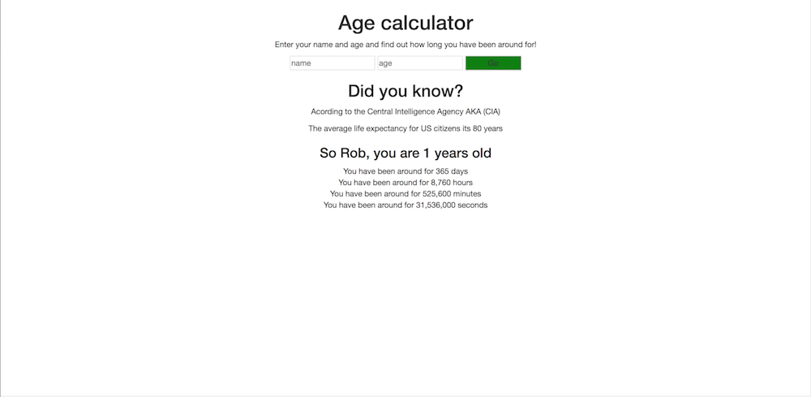

This is an application that will take user input and calculate how long that person has been around 
in days, hours, minutes & seconds.

Test the project.
https://robydoidao2006.github.io/ageCalculator/

V.1.0
Grabs user input, and display how long the user has been alive, in days, hours, minutes & seconds

