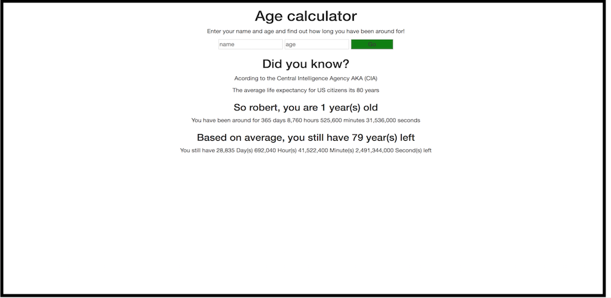
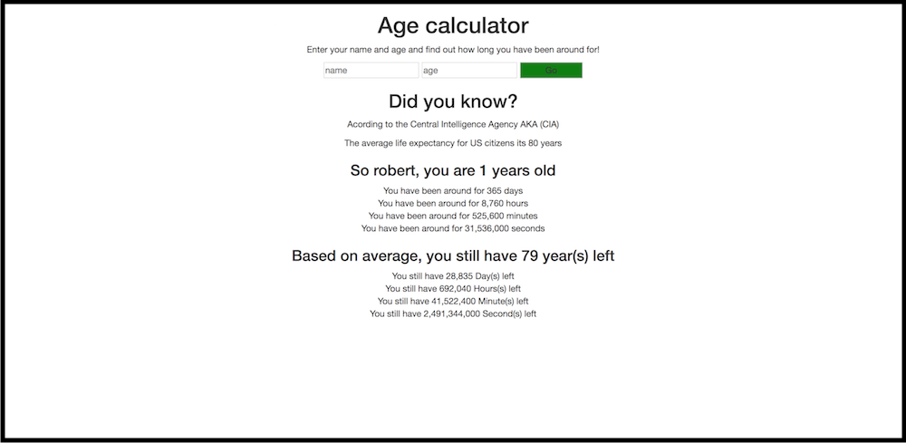

This is an application that will take user input and calculate how long that person has been around 
in days, hours, minutes & seconds.

Test the project.
https://robydoidao2006.github.io/ageCalculator/

V.2.1 ~ Date: 10/24/2018
Minor visual improvements
- all the information is being display in a single line
Minor technical improvements 
- code clean up
- concatinating 

V.2.0 ~ Date: 10/23/2018
New version uses calculation to display the remaining time left base on the average US citizens.

V.1.0 ~ Date: 10/22/2018
Grabs user input, and display how long the user has been alive, in days, hours, minutes & seconds.

